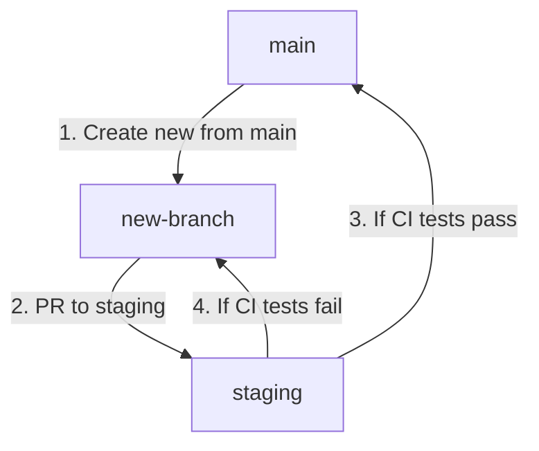

# Cat & Dog Classifier
Live Link: https://cat-and-dog-classifier-5b4x24knra-uc.a.run.app/

## Branch Metodology
Create new branch from `main` branch, work on the code, and PR to `staging` branch. Once all the CI tests run successfully, the `staging` will auto PR to `main`. The diagram below illustrates the flow:

Note: The `main` and `staging` branches are protected (and deletion protected), you cannot directly commit or PR to the `main` branch. The only way to commit to `main` is to PR to `straging`. If the CI tests on `staging` passes, then the admin can do PR from `staging` to `main`. But, if the CI tests fail, you need to review the code, for we cannot PR to `staging`, thus cannot PR to `main` from `staging`.
