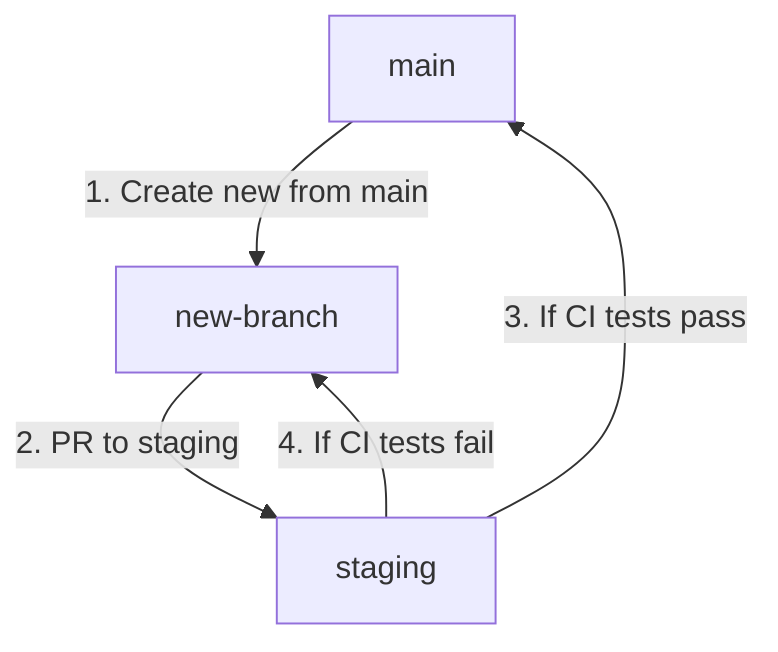

# Cat & Dog Classifier
Live Link: https://cat-and-dog-classifier-5b4x24knra-uc.a.run.app/

## Branch Metodology
Create new branch from `main` branch, work on the code, and PR to `staging` branch. Once all the CI tests run successfully, the `staging` will auto PR to `main`. The diagram below illustrates the flow:

testing
